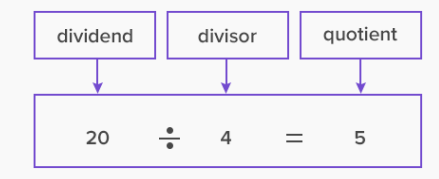

### START

### 기능 목록을 작성할 때

- 최대한 뭉뚱그려서 **크게 크게 분리**한다.
- 자잘한 한 판에서 죽고 사는 문제는 다른 `Status` 클래스를 만들어 관리하자 !!!
- 필요하면 나중에 수정하면 된다 !!!!
- 출력해야 하는 내용을 **view에 복붙**하면서 작성하자!!!

``` 
public enum ApplicationStatus {

    INITIALIZE_APPLICATION,
    START_GAME,
    END_GAME,
    APPLICATION_EXIT;

    public boolean isPlayable() {
        return this != APPLICATION_EXIT;
    }
}
```

#### 패키지 나누기

- `controller` `model` `util` `view` 패키지 생성
- `util` 패키지 안에 `Util` 클래스 생성 (여러번 사용되는 것들)
- `util` 패키지 안에 `validator` 패키지 생성

###### 그 다음, view부터 만들자!!!

#### OutputView

```
public class OutputView {
    
  public void printGameStart() { 
    System.out.println(Message.OUTPUT_GAME_START.message);
  }
  
    public void printExceptionMessage(IllegalArgumentException exception) {
        System.out.println(exception.getMessage());
    }
  
  private enum Message {
        OUTPUT_GAME_START("게임을 시작합니다.");

        private final String message;

        Message(String message) {
            this.message = message;
        }
    }


}
```

### InputView

```
public class InputView {

    public int readBudget() {
        System.out.println(Message.INPUT_BUDGET.message);
        String input = Console.readLine();
       // String input = Util.removeSpace(Console.readLine());
        // validate
        return Integer.parseInt(input);
    }
    
     private enum Message {
        INPUT_BUDGET("구입금액을 입력해 주세요.");

        private final String message;

        Message(String message) {
            this.message = message;
        }
    }
}
```

# Controller & Application

!!! 먼저 생명주기 관리 ver 쓰고 아래에 '안관리 ver' 첨부하겠음

##### 생명주기 관리 ver

### 생명주기 관리 ver `GameController`

```
public class GameController {
    private final InputView inputView;
    private final OutputView outputView;
    private final Map<ApplicationStatus, Supplier<ApplicationStatus>> gameGuide;

    public GameController(InputView inputView, OutputView outputView) {
        this.inputView = inputView;
        this.outputView = outputView;
        this.gameGuide = new EnumMap<>(ApplicationStatus.class);
        initializeGameGuide();
    }

    private void initializeGameGuide() {
        gameGuide.put(ApplicationStatus.INITIALIZE_APPLICATION, this::initialSetting);
        gameGuide.put(ApplicationStatus.START_GAME, this::startGame);
        gameGuide.put(ApplicationStatus.END_GAME, this::endGame);
    }

    public ApplicationStatus progress(ApplicationStatus applicationStatus) {
        try {
            return gameGuide.get(applicationStatus).get();
        } catch (IllegalArgumentException exception) {
            outputView.printExceptionMessage(exception);
            return applicationStatus;
        }
    }
```

### 생명주기 관리 ver `Application`

```
  public class Application {
    public static void main(String[] args) {
        InputView inputView = new InputView();
        OutputView outputView = new OutputView();

        ApplicationStatus applicationStatus = ApplicationStatus.INITIALIZE_APPLICATION;
        GameController gameController = new GameController(inputView, outputView);

        do {
            applicationStatus = gameController.progress(applicationStatus);
        } while (applicationStatus.isPlayable());
    }
}
```

##### 생명주기 '안관리 ver'

#### Application

```
public class Application {
    public static void main(String[] args) {
        InputView inputView = new InputView();
        OutputView outputView = new OutputView();

        GameController gameController = new GameController(inputView, outputView);
        gameController.play();
    }
}
```

#### GameController

- 게임에 필요한 다른 변수들이 많으면 `GameVariable` 클래스 생성을 고려한다.

```
public class GameController {
    private final InputView inputView;
    private final OutputView outputView;

    public GameController(InputView inputView, OutputView outputView) {
        this.inputView = inputView;
        this.outputView = outputView;
    }

    public void play() {
        outputView.printGameStart();
    }
}
```

### 출력 메세지 처리

#### ExceptionMessage

- 고냥 모든 Message에 사용 가능
- 클래스 분리하지 않고 해당 클래스 안에서 `private`

```
public enum ExceptionMessage {

    INVALID_NOT_NUMERIC("자연수만 입력 가능합니다."),
    INVALID_OUT_OF_INT_RANGE("입력 범위를 초과하였습니다.");

    public static final String BASE_MESSAGE = "[ERROR] %s";
    private final String message;

    ExceptionMessage(String message, Object... replaces) {
        this.message = String.format(BASE_MESSAGE, String.format(message, replaces));
    }

    public String getMessage() {
        return message;
    }
}
```

- 예외를 던지는 곳에서
  `throw new IllegalArgumentException(ExceptionMessage.~~.getMessage());`
- 같은 클래스 내면
  `throw new IllegalArgumentException(ExceptionMessage.~~.message);`

## Util

- 필요한 것만 골라다 쓰자!

``` 
public class Util {

    public static String removeSpace(String input) {
        return input.replaceAll(Regex.SPACE.regex, Regex.NO_SPACE.regex);
    }

    public static String removeDelimiters(String input) {
        return input.replace(Regex.SQUARE_BRACKETS_START.regex, Regex.NO_SPACE.regex)
                .replace(Regex.SQUARE_BRACKETS_END.regex, Regex.NO_SPACE.regex);
    }

    public static List<String> splitByComma(String input) {
        return Arrays.asList(Util.removeSpace(input).split(Regex.COMMA.regex));
    }

    public static List<String> formatProductInfo(String input) {
        return Util.splitByComma(Util.removeDelimiters(Util.removeSpace(input)));
    }


    private enum Regex {
        SPACE(" "), NO_SPACE(""),
        SQUARE_BRACKETS_START("["), SQUARE_BRACKETS_END("]"),
        COMMA(",");

        private final String regex;

        Regex(String regex) {
            this.regex = regex;
        }
    }

    private Util() {
    }
}
```

## Validation

#### Validator 추상메서드 생성

```
public abstract class Validator {

    private static final Pattern NUMBER_REGEX = Pattern.compile("^[0-9]*$");

    abstract void validate(String input) throws IllegalArgumentException;

    static String removeSpace(String input) {
        return input.replaceAll(" ", "");
    }

       void validateNumeric(String input) {
        if (!NUMBER_REGEX.matcher(input).matches()) {
            throw new IllegalArgumentException(ExceptionMessage.INVALID_NOT_NUMERIC.getMessage());
        }
    }

    void validateRange(String input) {
        try {
            Integer.parseInt(input);
        } catch (NumberFormatException exception) {
            throw new IllegalArgumentException(ExceptionMessage.INVALID_OUT_OF_INT_RANGE.getMessage(), exception);
        }
    }

    void validateNumberRange(String input) {
        int number = Integer.parseInt(input);
        if (number < Range.MIN_RANGE.value || number > Range.MAX_RANGE.value) {
            throw new IllegalArgumentException();
        }
    }
    private enum Range{
        MIN_RANGE(3), MAX_RANGE(20);

        private final int value;

        Range(int value) {
            this.value = value;
        }
    }
}
```

#### 자손 클래스로 구체화

```
public class BridgeSizeValidator extends Validator {
    private enum Range {
        MIN_RANGE(3), MAX_RANGE(20);

        private final int value;

        Range(int value) {
            this.value = value;
        }
    }

    private static final Pattern NUMBER_REGEX = Pattern.compile("^[0-9]*$");

    @Override
    public void validate(String input) throws IllegalArgumentException {
        validateNumeric(input);
        validateRange(input);
        validateNumberRange(input);
    }

```

- 테스트 코드도 동시에 작성
    - `removeSpace`는 `inputView`에서 이미 행하고 나서 들어오는 것이기 때문에 여기서는 공백 제거를 테스트하면 안됨

```
class BudgetValidatorTest {

    private BudgetValidator budgetValidator;

    @BeforeEach
    void setUp() {
        budgetValidator = new BudgetValidator();
    }

    @Nested
    class invalidInputTest {

        @ParameterizedTest
        @ValueSource(strings = {"한글", "moonja", " -1000 ", "-2322190000"})
        @DisplayName("자연수가 아닌 입력의 경우 예외 처리한다.")
        void 자연수가_아닌_입력(String input) {
            assertThatIllegalArgumentException()
                    .isThrownBy(() -> validator.validate(input))
                    .withMessageStartingWith(ExceptionMessage.INVALID_NOT_NUMERIC.getMessage());
        }
        
        //   assertThatThrownBy(() -> budgetValidator.validate(input))
        //            .isInstanceOf(IllegalArgumentException.class)
        //            .hasMessage(ExceptionMessage.OUT_OF_RANGE.getMessage());

        
        @ParameterizedTest
        @ValueSource(strings = {"2222222222222222222222222222000", "1294013905724312349120948120000"})
        @DisplayName("int 범위를 초과한 입력의 경우 예외 처리한다.")
        void int_범위를_벗어난_입력(String input) {
            assertThatIllegalArgumentException()
                    .isThrownBy(() -> budgetValidator.validate(input))
                    .withMessageStartingWith(ExceptionMessage.INVALID_OUT_OF_INT_RANGE.getMessage());
        }

    }

    @Nested
    class validInputTest {
        @ParameterizedTest
        @ValueSource(strings = {"222000", "22222000", " 1000"})
        void 정상_입력(String input) {
            assertThatCode(() -> budgetValidator.validate(input))
                    .doesNotThrowAnyException();
        }

    }
}
```

## Constants

- 다양한 자료형의 상수가 모여있다면 `Enum`을 활용하기 어려움
- 한 클래스가 아니라 여러 클래스에서 사용되는 상수의 경우 따로 클래스를 만들자!

``` 
public class Constants {

    public static final int NUMBER_COUNT = 6;
    public static final int MIN_RANGE = 1;
    public static final int MAX_RANGE = 45;
    public static final int LOTTO_PRICE = 1000;

    private Constants() {
    }
}

```

### `MapPractice` 을 key, value (키, 값) 순으로 출력하기

``` 
    Map<Integer, Integer> map = new HashMap<>();
    map.put(100, 1);
    map.put(200, 2);
    for (Map.Entry<Integer, Integer> element : map.entrySet()) {
        System.out.println(String.format("%d원 - %d개", element.getKey(), element.getValue()));
    }
```

## ResultFormatter

- 결과값을 출력하는 과정이 복잡할 때
- 결과값을 formatting하는 일을 model이 하는 것은 부적절, view에서 하기에도 클 수 있다.

### 큰 숫자 다루기 `BigDecimal`

- 소수점, 반올림을 빡세게 요구할 때
- 너무 복잡한 수나, 아니면 돈을 다루는 경우에 바로 사용하자!
- 퍼센트를 구한 다음에 `1,000.3%` 꼴로 출력하자
- `ArithmeticException`을 조심하자!

- dividend, divisor, quotient
  

- 소수점 아래 둘째 자리에서 반올림 `1.35 => 1.4`

``` 
    private static BigDecimal getSetScale(BigDecimal rewardRate) {
        return rewardRate.setScale(1, RoundingMode.HALF_EVEN);
    }
```

- 퍼센트 구하기 `totalCashPrize / ticketBudget * 100` + 소수점 아래 둘째 자리에서 반올림

``` 
 private static BigDecimal calculatePercent(BigDecimal totalCashPrize, BigDecimal ticketBudget) {
        if (ticketBudget.equals(BigDecimal.ZERO)) {
            return BigDecimal.ZERO;
        }
        return totalCashPrize.multiply(new BigDecimal("100")).divide(ticketBudget, 1, RoundingMode.HALF_EVEN);
    }
```

- 이외의 `REGEX`를 활용한 `formatting`

``` 
   private enum Regex {
        CASH_PRIZE_REGEX("\\B(?=(\\d{3})+(?!\\d))"), 
        DECIMAL_FORMAT("#,##0.0");

        private final String regex;

        Regex(String regex) {
            this.regex = regex;
        }
    }

    // 12345 => 12,345
    public static String formatRewardRate(BigDecimal rewardRate) {
        return new DecimalFormat(Regex.DECIMAL_FORMAT.regex).format(rewardRate);
    }

    // 324329209.35823 => 324,329,209.4
    private static String formatCashPrize(int cashPrize) {
        return String.valueOf(cashPrize).replaceAll(Regex.CASH_PRIZE_REGEX.regex, ",");
    }
```

### Enum 클래스 관리

#### Command 관리!!! (사용자가 입력한 옵션)

```
public enum MainOption {
    PAIR_MATCHING("1"),
    PAIR_SEARCHING("2"),
    PAIR_INITIALIZING("3"),
    QUIT("Q");

    private final String command;

    MainOption(String command) {
        this.command = command;
    }

    public static MainOption from(String command) {
        return Arrays.stream(MainOption.values())
                .filter(option -> option.command.equals(command))
                .findAny()
                .orElseThrow(() -> new IllegalArgumentException(ExceptionMessage.NO_MAIN_OPTION.getMessage()));
    }
    
    // NO_MAIN_OPTION => "해당하는 메인 옵션이 존재하지 않습니다."

    public boolean continueMain() {
        return this != QUIT;
    }

}
```
