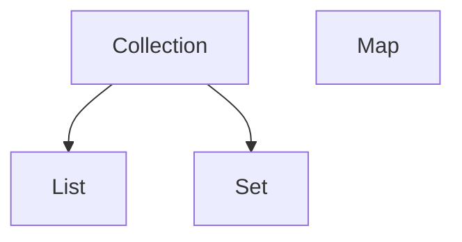

## 변수

#### 4 변수의 타입

- 숫자
    - 정수: `int`[기본], `long`(10자리 수가 넘을 때)[접미사 L 필요]
    - 실수: `float`(오차 없이 7자리)[접미사 f 필요], `double`(오차 없이 15자리)[기본]
- 문자
    - `char`(문자), `String`(문자열, 여러 문자)

#### 5 상수와 리터럴

- 변수: 하나의 값을 저장하기 위한 공간 `year`
- 상수: 값을 한 번만 저장할 수 있는 공간 `MAX_VALUE`
- 리터럴: 그 자체로 값 `2014` `100`

``` 
int year = 2014;
final int MAX_VALUE = 100;
```

## 객체지향 프로그래밍 1

##### 23 ~ 24

- 기본형 매개변수: 변수의 값을 읽기만 할 수 있다.
- 참조형 매개변수: 변수의 값을 읽고 변경할 수 있다.

#### 28 static은 언제 붙여야 할까?

1. 클래스를 설계할 때, 모든 인스턴스에서 같은 값이 유지되어야 하는 변수
2. 클래스 메서드(`static` 메서드)는 인스턴스 변수를 사용할 수 없다.
    - 인스턴스 변수는 인스턴스가 반드시 존재해야 사용 가능한데, 클래스 메서드는 인스턴스 생성 없이 호출 가능하므로 클래스 메서드가 호출되었을 때 인스턴스가 존재하지 않을 수도 있음
3. 메서드 내에서 인스턴스 변수를 사용하지 않는다면, `static`을 붙이는 것을 고려한다.
    - 호출 시간이 짧아지므로 성능이 향상된다.

#### 30 오버로딩

1. 메서드 이름이 같음
2. 매개변수의 개수, 또는 타입이 달라야함
3. 반환 타입은 관계 없음 (호출 시 어떤 메서드를 호출해야 하는지 구분할 수 없음)

#### 32 생성자

- **인스턴스 초기화 메서드**: 인스턴스 변수들을 초기화 (인스턴스 생성 X)
- 이름은 클래스의 이름과 같고, 리턴 값이 없음
- 클래스에 정의된 생성자가 하나도 없을 때에는 기본 생성자(아무것도 없음)가 자동으로 생성된다

#### 36 생성자에서 다른 생성자 호출하기 `this()`

- 두 가지 조건 만족 시, 오버로딩된 생성자 간에도 서로 호출 가능
    - 생성자의 이름으로 클래스이름 대신 `this` 사용
    - 한 생성자에서 다른 생성자를 호출할 때는 반드시 첫 줄에서만 호출 가능
        - 초기화 작업 도중 다른 생성자를 호출하면, 호출한 다른 생성자 내에서도 멤버변수들의 값을 초기화해 이전 초기화 작업이 무의미해질 수 있기 때문

```
Car() {
   this("white", "auto"4);
}

Car(String color) { 
   this(color, "auto", 4);
}
```

- 같은 클래스 내 생성자들은 일반적으로 서로 관계가 깊은 경우가 많아서 서로 호출하도록 하여 유기적으로 연결해주면 더 좋은 코드를 얻을 수 있음
- 수정이 필요한 경우, 적은 코드만 변경해주면 되어 유지보수가 편해짐

#### 37 객체 자신을 가리키는 참조변수 `this`

- 생성자의 매개변수와 인스턴스 변수의 이름이 같으면 구분이 안됨 => 인스턴스 변수 앞에 `this`를 사용한다.
- `this`는 참조변수로 인스턴스 자신을 가리킴
- `static` 메서드에서는 `this` 사용 불가
- 생성자를 포함한 모든 인스턴스 메서드에는 `this`가 지역변수로 숨겨진 채로 존재함

> - **this** 인스턴스 자신을 가리키는 참조변수, 인스턴스의 주소가 저장되어 있음
>- **this(), this(매개변수)** 같은 클래스의 다른 생성자를 호출할 때 사용
>- 비슷하게 생겼지만, 완전히 다른 것 !!!

#### 38 변수의 초기화

- 클래스 변수와 인스턴스 변수(자동으로 기본값으로 초기화), 배열의 초기화는 선택
- 지역변수의 초기화는 필수

#### 39 멤버변수의 초기화

1. 클래스 변수 초기화 => 인스턴스 변수 초기화
2. 자동 초기화 => 명시적 초기화(간단한 내용) => 초기화 블럭, 생성자(복잡한 내용)

- 명시적 초기화: 변수를 선언과 동시에 초기화 (간단)
- 초기화 블럭
    - 클래스 초기화 블럭
      ```
      static { 
       // 클래스 초기화 블럭
      // 처음 메모리에 로딩될 때 한번만 실행 
      }
      
      { 
      // 인스턴스 초기화 블럭
      // 인스턴스가 생성될 때마다 수행
      }
      ```

## 객체지향 프로그래밍 2

#### 1 상속

- 자손 클래스는 조상 클래스의 모든 멤버를 상속 받는다 (생성자, 초기화블럭 X)
- 자손 클래스의 멤버 개수는 조상 클래스보다 항상 같거나 많다 `extends`

#### 3 클래스 간 포함관계

``` 
Class Circle { 
    int x;
    int y; 
    int r;
}

Class Point {
    int x;
    int y;
}
```

- `Point` 클래스를 재사용해서 `Circle` 클래스를 작성한다면,

``` 
class Circle {
    Point c = new Point();
    int r;
}
```

#### 4 상속 VS 포함

- is a / has a 로 문장을 만들어보자.
- Circle is a Point VS Circle has a Point
- 후자가 더 자연스럽다면, 포함관계를 맺어주는게 옳다

#### 7 오버라이딩

- 상속받은 메서드를 자손 클래스 자신에 맞게 변경해 사용하는 것

1. 메서드의 내용만을 새로 작성하는 것이므로, 선언부(이름, 매개변수, 반환타입)은 조상의 것과 완전히 일치해야 함
    - 접근 제어자, 예외는 제한된 조건 하에서 다르게 변경 가능
2. 접근 제어자는 조상 클래스의 메서드보다 좁은 범위로 변경할 수 없다
3. 조상 클래스의 메서드보다 더 많은 수의 예외를 선언할 수 없다.

#### 9 오버로딩 VS 오버라이딩

- 오버로딩: 기존에 없던 새로운 메서드를 정의하는 것
- 오버라이딩: 상속받은 메서드의 내용을 변경하는 것

#### 19 `final`

- 마지막의, 변경될 수 없는
- 변수: 변경할 수 없는 상수
- 메서드: 오버라이딩을 할 수 없음
- 클래스: 확장하는 자손 클래스를 정의하지 못함

#### 20 `abstract`

- 미완성의
- 메서드: 메서드의 선언부만 작성하고 실제 수행내용을 구현하지 않은 추상 메서드를 선언하는데 사용됨
- 클래스: 클래스 내에 추상 메서드가 선언되어 있음을 의미함 = 추상 클래스
- 추상 클래스는 아직 완성되지 않은 메서드가 존재하므로 인스턴스를 생성할 수 없다

#### 21 접근 제어자

- `private`: 같은 클래스 내에서만
- `(default)`: 같은 패키지 내에서만
- `protected`: 같은 패키지 내, 다른 패키지의 자손 클래스에서
- `public`: 접근 제한이 없음

#### 23 다형성

``` 
class Tv { 
    boolean power;
    int channel;
    
    void power() { }
    void channelUp() { }
    void channelDown() { }
}

class SmartTv extends TV {
    String text;
    void caption() { }
}
```

- 조상 클래스인 `Tv`를 상속한 자손 클래스 `SmartTv`
- 생성된 인스턴스`new Tv()`를 다루기 위해 인스턴스 타입과 일치하는 타입의 참조변수`Tv t`를 사용해왔음

``` 
Tv t = new Tv();
SmartTv s = new SmartTv();
```

- 상속 관계에 있을 경우, 조상 클래스 타입의 참조변수로 자손 클래스의 인스턴스를 참조하도록 하는 것이 가능하다!

``` 
Tv t = new SmartTv();
```

- 하지만 이렇게 하는 경우, 참조변수 `t`에는 조상 클래스를 담는 공간이 할당되어 있어서 새로 정의한 `text`와 `caption()`은 사용 불가
- 반대로 자손 타입의 참조변수로 조상 타입의 인스턴스를 참조할 수는 없다.

#### 24 참조변수의 형변환

- 상속 관계에 있는 타입간의 형변환은 양방향으로 자유롭게 수행될 수 있음
- 참조변수가 가리키는 인스턴스의 자손타입으로의 형변환은 허용되지 않음

## 예외 처리

#### 1 프로그램 오류

- 컴파일 에러: 컴파일 시에 발생하는 에러
- 런타임 에러: 프로그램 실행 도중에 발생하는 에러
- 논리적 에러: 컴파일도 잘 되고 실행도 잘 되지만 의도와 다르게 동작하는 것


- 에러: 프로그램 코드에 의해 수습될 수 없는 심각한 오류 (메모리 부족, 스택 오버플로우), 발생하면 복구할 수 없음
- 예외: 다소 미약한 오류

- 예외는 `Exception` 클래스의 후손, 에러는 `Error` 클래스의 후손

#### 3 `RuntimeException`

- `Exception` 클래스들: **사용자**의 실수와 같은 외적인 요인에 의해 발생
    - 주로 외부의 영향으로 발생
    - 입력한 데이터의 형식이 잘못됨 `DataFormatException`
- `RuntimeException` 클래스들: **프로그래머**의 실수로 발생
    - 배열 범위를 벗어남 `ArrayIndexOutOfBoundsException
    - 값이 `null`인 참조변수의 멤버를 호출하려 함 `NullPointerException`
    - 클래스간 형변환을 잘못함 `ClassCastException`
    - 정수를 0으로 나누려고 함 `ArithmeticException`

## java.lang패키지와 유용한 클래스

#### 11 String 클래스

- `char charAt(int index)` index에 있는 문자를 알려줌
- `int compareTo(String str)` 문자열과 사전 순서로 비교해, 같으면 0, 이전이면 -1, 이후면 1 반환
- `String concat(String str)` 문자열을 뒤에 덧붙임
- `contains` `endsWith` `equals` `equalsIgnoreCase` `indexOf(int ch)`
- `lastIndexOf` `replace(char old, char new)` `replaceAll(String regex, String replacement)` `replaceFirst`
- `split` `substring` `trim`

#### 12 `StringJoiner`

``` 
StringJoiner sj = new StringJoiner(",", "[", "]");
String[] strArr = {"aaa", "bbb", "ccc"};

for (String s : strArr) {
    sj.add(s.toUpperCase());
}

// [AAA, BBB, CCC]
```

#### 13 문자열과 기본형 간의 변환

- 문자 <==> 숫자
    - 기본형 ==> `String`
      ``` 
        int i = 100;
        String str1 = i + "";
        String str2 = String.valueOf(i);
      ```
    - `String` ==> 기본형
      ```
       int i = Integer.parseInt("100");
       int i2 = Integer.valueOf("100");
      ```

- `Integer.parseInt` 전에 공백 제거
    - `int val = Integer.parseInt("   123    ".trim());`
    - 문자열을 숫자로 바꾸는 과정에서 에러가 많이 발생하므로 조심해 주어야 함

#### 17 `StringBuffer`의 변경

``` 
StringBuffer sb = new StringBuffer("abc");
sb.append("123").append("zzz"); // 반환 타입이 자신의 주소
```

#### 18 `StringBuffer`의 비교

- `equals` 메서드를 오버라이딩하지 않아서, 사용하면 안됨.
- `toString()`을 호출해서 String 인스턴스를 얻은 후 `equals` 메서드를 사용해 비교해야 함

``` 
String s = sb.toString();
String s2 = sb2.toString();

s.equals(s2);
```

#### 22 반올림

- `round()`를 사용해야 하는데, 항상 소수점 첫째자리에서 반올림한 정수값(`long`)을 결과로 돌려준다
- 원하는 자리 수에서 반올림된 값을 얻기 위해선, 간단히 10의 n제곱으로 곱한 후 다시 곱한 수로 나눠준다
- 예) 90.7552를 소수점 둘째 자리까지 구하고 싶다 => 10**2를 곱하고 나눈다
- 주의) 정수형 간의 연산에서는 반올림이 이루어지지 않는다.

```
1. 90.7552 * 100 = 9075.52
2. Math.round(9075.52) = 9076
3. 9076 / 100.0 = 90.76
```

## 날짜와 시간 & 형식화

#### 10 `Decimal Format`

- `0` : 10진수 (값이 없을 때는 0)
- `#` : 10진수
- `.` : 소수점
- `-` : 음수 부호
- `,` : 단위 구분자
- `E` : 지수 기호
- `;` : 패턴 구분자
- `%` : 퍼센트
- `\u00A4` : 통화
- ` : escape문자

``` 
double number = 1234567.89;
DecimalFormat df = new DecimalFormat("#.#E0");
String result = df.format(number); // "1.2E6"

\u00A4 #,### => \(원) 1,234,568
```

#### 13 `SimpleDateFormat`

``` 
Date today = new Date();
SimpleDateFormat df = new SimpleDAteFormat("yyyy-MM-dd");
String result = df.format(today);

new SimpleDateFormat("오늘은 이 달의 d번째 날입니다.").format(today);
```

## 컬렉션 프레임워크

#### 1 컬렉션 프레임웍

- 라이브러리: (그래픽, 통계 등) 공통으로 사용될만한 유용한 기능을 모듈화해 제공
- 프레임웍: 단순 기능 뿐만 아니라 프로그래밍 방식을 정형화 => 생산성 UP 유지보수 GOOD

#### 2 핵심 인터페이스



- `List`
    - 순서 있는 데이터의 집합
    - 중복 허용
    - `ArrayList, LinkedList, Stack, Vector`
- `Set`
    - 순서 없음
    - 중복 불가능
    - `Hashset, TreeSet`
- `Map`
    - `key`와 `value`로 이루어진 데이터의 집합
    - 순서 없음
    - `key`는 중복 불가능, `value`는 중복 가능
    - `HashMap, TreeMap, HashTable, Properties`

#### 8 `ArrayList`의 메서드

``` 
ArrayList(Collection c) : 주어진 컬렉션이 저장된 ArrayList 생성
boolean addAll(Collection c)
boolean addAll(int index, Collection c)
int indexOf(Object o)
Iterator iterator()
int lastIndexOf(Object o) : 객체가 저장된 위치를 끝부터 역방향으로 검색해서 반환
ListIterator listIterator()
Object remove(int index)
boolean remove(Object o)
boolean retaianAll(Collection c) : 주어진 컬렉션과 공통된 것만 남기고 나머지를 삭제
Object set(int index, Object element)
void sort(Comparator c)
List subList(int fromIndex, int toIndex)
void trimToSize() : 빈 공간을 없앰
```

#### 14 `LinkedList`와 `ArrayList`

- `LinkedList` : 읽기 느림 / 추가 삭제 빠름 => 데이터가 많을수록 접근성이 떨어짐
- `ArrayList` : 읽기 빠름 / 추가 삭제 느림 => 순차적 추가 삭제는 더 빠름, 비효율적 메모리 사용
- 다루고자 하는 데이터의 개수가 변하지 않으면 `ArrayList` 사용
- 데이터 개수의 변경이 잦다면 `LinkedList` 사용

#### 15 `Stack`과 `Queue`

- `Stack` : LIFO

 ``` 
boolean empty()
Object peek() : Stack의 맨 위에 저장된 객체를 반환. pop()과 달리 꺼내지는 않음
Object pop() : 맨 위의 객체를 꺼냄 (최근에 저장한)
Object push(Object item)
int search(Object o): 주어진 객체를 찾아 위치(최근에 저장한게 1)를 반환, 못 찾으면 -1
```

- `Queue` : FIFO

##### 25 `Arrays` 복사

``` 
int[] arr = {0,1,2,3,4};
int[] arr2 = Arrays.copyOf(arr, arr.length); // [0,1,2,3,4]
int[] arr3 = Arrays.copyOf(arr,3); // [0,1,2]
int[] arr4 = Arrays.copyOfRange(arr,2,4); // [2,3] (끝은 불포함)
```

#### 26 `Arrays` 채우기, 정렬, 검색

- 같은 값, 랜덤값으로 배열 채우기

``` 
int[] arr = new int[5];
Arrays.fill(arr, 9); // [9,9,9,9,9]
Arrays.setAll(arr, (i) -> (int)(Math.random()*5) + 1); // [1,5,1,2,3]
```

- 배열 내 검색 (반드시 먼저 정렬)
- 이진 검색은 검색 범위를 반복적으로 절반씩 줄여가며 검색 => 매우 빠름

``` 
int[] arr = {3,2,0,1,4};
Arrays.sort(arr); // 필수 [0,1,2,3,4]
int index - Arrays.binarySearch(arr,2); // index = 2
```

#### 27 `Arrays` 비교와 출력

- 1차원 출력 `Arrays.toString(arr)` // [0,1,2,3,4]
- 2차원 이상 출력 `Arrays.deepToString(arr)` // [[11,12],[21,22]]
- 마찬가지로 `equals` `deepEquals` : 모든 요소를 비교해 같으면 `true` 반환

#### 28 `Arrays` 변환

- `List list = Arrays.asList(1,2,3,4,5);`
    - `asList(Object... a)`
    - `List` 크기 변경, 추가/삭제 불가

- `List list = new ArrayList(Arrays.asList(1,2,3,4,5));`
    - 크기 변경 가능

#### 31 정렬 `Comparator, Comparable`

- `String`
    - `String`의 `Comparable` 구현에 의한 정렬 : `Arrays.sort(arr)`
    - 대소문자 구별 안함: `Arrays.sort(arr, String.CASE_INTENSIVE_ORDER)`
    - 역순 정렬: `Arrays.sort(arr, new Descending())`

#### 35 `HashSet`

- `Lisk`를 구현한 클래스와 달리 순서를 유지하지 않기 때문에 저장한 순서와 다를 수 있음
- 중복을 제거하는 동시에 저장한 순서를 유지하려 한다면 `LinkedHashSet` 사용

## 지네릭스, 열거형, 애너테이션

#### 1 지네릭스 `Generics`

- 장점
    - 타입 안정성 제공
    - 타입 체크와 형변환을 생략할 수 있어 코드가 간결해짐

#### 4 지네릭스 용어

`class Box<T> { } `

- `Box<T>` : 지네릭 클래스
- `T` : 타입 변수 / 타입 매개변수
- `Box` : 원시 타입

##### 5 지네릭 타입과 다형성

``` 
ArrayList<Product> list = new ArrayList<Product>(); // Product: 대입된 타입
list.add(new Product());
list.add(new Tv());
list.add(new Audio()); // 자손이라면 모두 가능

// 대신 꺼낼 때 형변환 필요
Product p = list.get(0);
Tv t = (Tv)list.get(1);
```

#### 17 열거형 `Enum`

- 여러 상수를 선언해야 할 때 편리하게 선언할 수 있는 방법

```
class Card {
  enum Kind {CLOVER, HEART, DIAMOND, SPACE}
  enum Value {TWO, THREE, FOUR}
  
  final Kind kind;
  final Value value;
}
```

- 열거형의 생성자는 외부에서 호출 불가 (제어자가 묵시적으로 `private`이기 때문)

## 람다와 스트림

#### 5 함수형 인터페이스 `Functional Interface`

- 오직 하나의 추상메서드만 정의되어 있는 인터페이스
- 람다식과 인터페이스의 메서드가 1:1로 연결될 수 있음

- 람다식은, 함수형 인터페이스를 구현해놓은 익명 클래스
- 매번 이 함수형 인터페이스를 만들 수는 없음 => 자바에서 제공
    - `Runnable.run(), Supplier.get(), Consumer.accept(T t), Function.apply(T t), Predicate.test(T t)`

