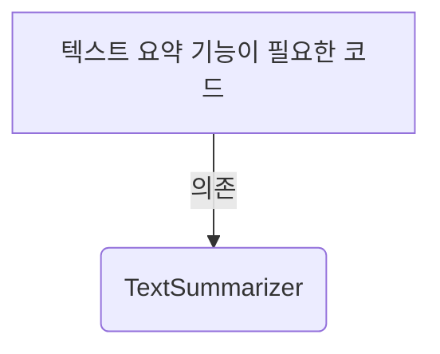
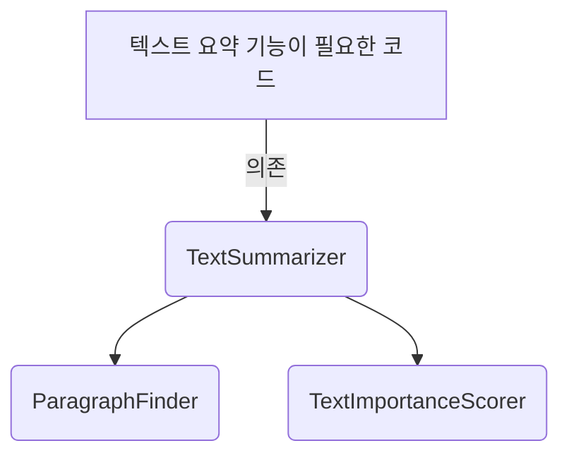
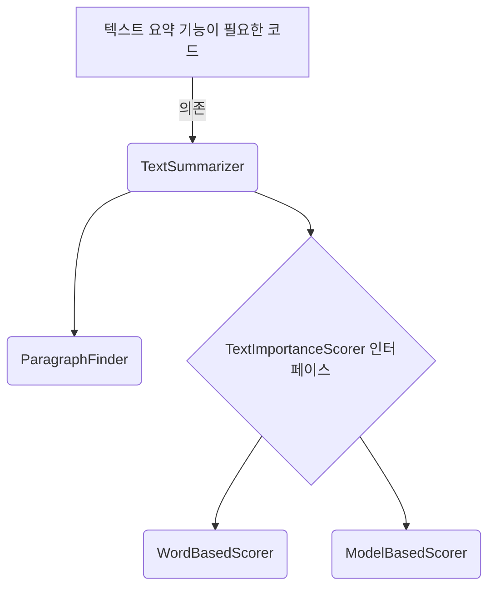

### 널값 및 의사코드 규약

- 널 값 처리
    - `NullPointerException` `NullReferenceException` 등등 처리

- JAVA의 널 안전성 지원 시 사용

``` 
Element? getFifthElement(List<Element> elements) {
    if (elements.size() < 5) {
        return null; 
    }
    return elements[4];
}
```

- 널 안전성 대신 `Optional` 타입을 사용해도 좋음

### 추상화 계층 및 코드 품질의 핵심 요소

1. 가독성
    - 개발자가 코드베이스에 있는 모든 세부 사항을 이해하지 않아도 됨
    - 한두 개 정도의 계층과 몇개의 개념만 다루면 됨
2. 모듈화
    - 추상화 계층이 하위 문제에 대한 해결책을 깔끔하게 나누고 구현 세부 사항이 외부에 드러나지 않도록 보장
3. 재사용성 및 일반화성
    - 하위 문제에 대한 해결책이 간결한 추상화 계층으로 제시되면 해당 하위 문제에 대한 해결책을 재사용하기 쉬워짐
4. 테스트 용이성
    - 각 하위 문제에 대한 해결책을 완벽하게 테스트하는 것이 쉬워짐

#### 예시

1. 모든 개념을 담고 있는 하나의 클래스 `TextSummarizer`



- `TextSummarizer`가 너무 많은 기능 담당
    - 텍스트 요약
    - 중요도 계산
    - 중요한 명사, 형용사, 동사 추출
    - 텍스트를 단락으로 나누기
    - 단락 시작 찾기
    - 단락 끝 찾기

- 문제점
    - 단락 수를 계산하는 기능이 필요한 코드를 다른 문제에 재사용 못함
    - 중요도 계산 알고리즘이 바뀌어도 기능의 일부를 교체할 수 없음
    - 너무 광범위한 내용을 다루어 테스트 코드를 작성하기 어려움 (세부 사항 테스트 어려움)

2. 개선 1) 역할에 따른 클래스 분리



- `TextSummarizer`
    - 텍스트 요약
- `ParagraphFinder`
    - 텍스트를 단락으로 나누기
    - 단락 시작 찾기
    - 단락 끝 찾기
- `TextImportanceScorer`
    - 중요도 계산
    - 중요한 명사, 형용사, 동사 추출

- 변화
    - 각 클래스당 개념 몇 가지만 가져서 코드 이해가 쉬워짐
    - 테스트 코드를 작성하기 쉬워짐
    - 단락 수 계산이 필요한 다른 코드가 있다면 `ParagraphFinder`를 재사용하면 됨
    - 중요도 계산 로직과 같은 중요한 것을 더 자세히 테스트할 수 있음
- 추가적으로 개선사항
    - 인터페이스를 통해서 중요도 계산 로직을 다양하게 작성할 수 있다면 더 좋을 것 같음
    - 예) 현재의 `TextImportanceScorer`의 방식 대신 머신러닝을 사용한 방법을 이용할 수도 있음

3. 개선 2) 인터페이스를 활용한 분리



- 변화
    - `TextImportanceScorer`를 인터페이스로 만듦
    - 인터페이스를 구현한 다양한 클래스가 모두 사용될 수 있음
    - 기존의 Scorer 역할을 하던 것을 `WordBasedScorer`로, 머신러닝을 활용하는 경우를 `ModelBasedScorer`로 변경

- 고민해야 하는 점
    - 추상화 계층에 대해 한 가지 구현만 있고 향후 다른 버전이 없다면 인터페이스로 굳이 만들어야 하는가를 고민해야 함
    - 극단적으로 모든 클래스에 대해서 다 인터페이스를 하나씩 붙이는 것도 구림
    - 그치만 지금 하나의 방법밖에 없다고 생각하는 건 나의 착각일 수도 있음

- 하나의 인터페이스 단일 구현 시 그래도 장점
    - 퍼블릭 API를 명확하게 보여줌
        - 한 계층에서 사용해야 하는 기능, 사용하지 말아야 하는 기능에 대한 가이드라인을 인터페이스가 명확하게 잡아주어 기능에 대해 혼동 X
            - 만약에 개발자가 인터페이스를 구현한 클래스에 `public` 함수를 추가하더라도, 상위 계층은 인터페이스에만 의존하기 때문에 이 함수는 상위에 노출되지 않음
        - 한 가지 구현만 필요하다고 (버전이 한개라고) 잘못 추측한 것일 수도 있음
        - 테스트가 쉬워짐
            - 테스트 중에 *mock이나 페이크 객체*로 대체할 수 있음 (고민해보자!)
